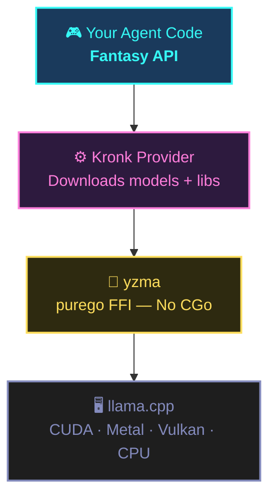
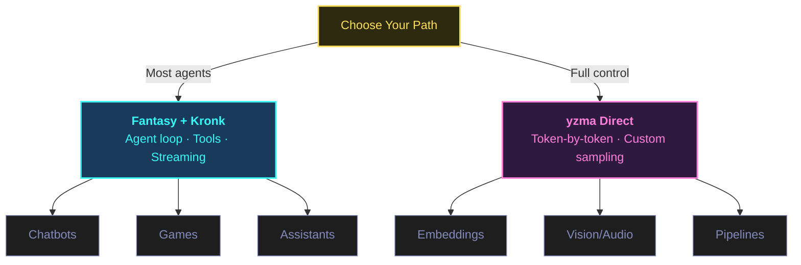
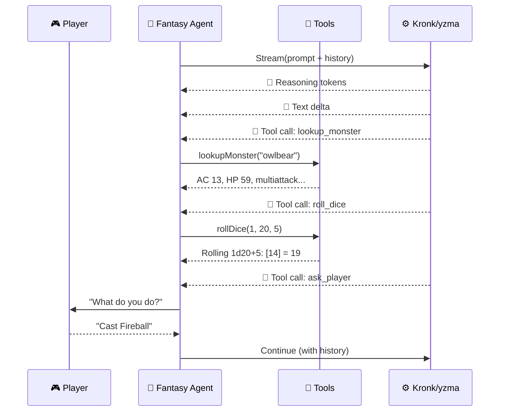

# Build a Local AI Dungeon Master in Go

No CGo. No Python. No Cloud.

<!--
Building a fully local AI agent in Go — with tool calling, streaming, and chain-of-thought reasoning — has never been this clean. And I mean that. No Python. No CGo. No cloud API. Not even an API key.
-->

---
layout: section
---

# The Problem with CGo

<!--
And I know that because I spent way too long trying to do this the *wrong* way.

Go and local AI used to be a disaster. The whole inference ecosystem was Python-only. If you wanted llama.cpp from Go, you needed CGo bindings — and if you've ever maintained CGo bindings against a library that ships a breaking change every two weeks... it's not fun. Cross-compilation breaks. The debugger refuses to cross the Go-C boundary. And the bindings lag behind upstream by months.

So most Go developers just gave up. Paid for a cloud API. Sent their data off-machine. That was the reality.
-->

---

<v-clicks>

- Go ↔ C boundary = **debugging nightmare**
- Cross-compilation **breaks constantly**
- Bindings lag upstream by **months**
- Most Go devs just gave up → **cloud APIs**

</v-clicks>

<!--
Cross-compilation breaks. The debugger refuses to cross the Go-C boundary. And the bindings lag behind upstream by months.

So most Go developers just gave up. Paid for a cloud API. Sent their data off-machine.
-->

---

<v-clicks>

- **yzma** by Hybridgroup — `purego` FFI to llama.cpp
- No C compiler. No CGo. Just `go build`
- One project unlocked the **entire stack**

</v-clicks>

<!--
Here's what changed. One project — yzma by Hybridgroup — figured out how to bind to llama.cpp using purego. Pure Go FFI. No C compiler. No CGo headaches. Just go build and it works. And that one breakthrough unlocked an entire stack.
-->

---

<v-clicks>

- **What The Func** — Go in the real world
- **Mark3labs** — Go tools for the AI ecosystem
- **mcp-go** — one of the most-used MCP libraries in Go

</v-clicks>

<!--
I run What The Func — this channel — focused on Go in the real world. And at Mark3labs, we build Go tools for the AI ecosystem. We shipped mcp-go, which has become one of the most-used MCP libraries in the Go ecosystem, so I pay close attention to what's actually working in Go AI tooling right now.

And what I'm seeing is a genuine shift. The Go AI stack is real, it's production-ready, and the demo you're about to see is proof.
-->

---

<v-clicks>

- 🎲 A **local AI Dungeon Master** — real monster stats, real dice, streaming reasoning
- ⚡ Why `purego` was the **breakthrough** for CGo-free inference
- 🏗️ The **three-project stack** — Fantasy, Kronk, and yzma
- 🔧 Both the **high-level** agent approach AND **raw inference**

</v-clicks>

<!--
In this video, I'm going to show you:

A fully local AI dungeon master that runs D&D 5e encounters on your machine — real monster stats, real dice, streaming chain-of-thought reasoning.

Why purego was the breakthrough that made CGo-free local inference possible in Go.

The complete three-project stack — Fantasy, Kronk, and yzma — and how they layer together.

Both the high-level agent approach AND the raw inference path, so you understand what's actually happening under the hood.
-->

---

<div class="mt-8 text-center">
  <GlowText color="cyan">Let's roll initiative.</GlowText>
</div>

<!--
Here's the plan. First, I'll explain the stack — Fantasy, Kronk, and yzma — and why they fit together the way they do. Then we'll look at the two approaches to local inference in Go and which one to choose. Then I'll show you the actual data on why this stack is worth your attention. And in the final section, I'll walk you through the full dungeon master code, then show you what raw inference with yzma looks like when you want to go even lower.

Alright. Let's roll initiative.
-->

---
layout: section
---

# The Stack

Fantasy + Kronk + yzma

<!--
Before we write a single line of code, let me show you how this stack fits together — because once you understand the architecture, the code makes a lot more sense.

Three projects. Three layers. Each one does exactly one thing.
-->

---

<v-clicks>

<NeonBox color="cyan">

**Fantasy** (Charmbracelet) — Agent API
System prompts · Tool definitions · Generate / Stream

</NeonBox>

<NeonBox color="pink">

**Kronk** (Ardan Labs) — Local Provider
Downloads models (GGUF) · Downloads llama.cpp libs · Manages lifecycle

</NeonBox>

<NeonBox color="yellow">

**yzma** (Hybridgroup) — Pure Go FFI
Direct llama.cpp binding · Hardware-accelerated · No CGo

</NeonBox>

</v-clicks>

<!--
At the top, Fantasy — by Charmbracelet — gives you a unified API for building agents. You define tools, set a system prompt, and call Generate or Stream. It's completely provider-agnostic. You can point it at Anthropic, OpenAI, OpenRouter, or in our case, Kronk. Same API, different backend.

Kronk is the local inference layer. When Fantasy asks for a completion, Kronk handles downloading the model file, loading it into memory, and running inference. It wraps yzma with a higher-level API that feels like working with any other LLM client.

yzma is the foundation and the breakthrough. Pure Go FFI to llama.cpp — no CGo. The first run downloads the precompiled llama.cpp native libraries automatically. No C toolchain. No build system. Just go run.

And underneath it all, llama.cpp does the actual inference with hardware acceleration — CUDA on NVIDIA, Metal on Mac, Vulkan on everything else.
-->

---



<!--
At the top, Fantasy gives you the agent API. It talks to Kronk, which manages model downloads and inference lifecycle. Kronk uses yzma underneath — pure Go FFI to llama.cpp. And llama.cpp does the actual GPU-accelerated inference. Each layer does exactly one thing.
-->

---

<v-clicks>

- First `go run` → **everything downloads automatically**
- llama.cpp libraries ✅
- Model weights ✅
- No installation step. No shell script. No Makefile.
- Colleague clones repo → `go run .` → **it works**

</v-clicks>

<!--
Here's what makes this significant: the first time you go run your program, everything downloads automatically — the llama.cpp libraries, the model weights, all of it. No installation step. No shell script. No Makefile. Your colleague clones the repo and runs it. Done.

So that's the architecture. Now the question is — how do you want to interact with it?
-->

---
layout: section
---

# Choose Your Path

<!--
There are actually two ways to use this stack, and they suit different situations. I'm going to show you both today so you have the full picture.
-->

---



---

<div class="grid grid-cols-2 gap-8 mt-4">

<div v-click>
<NeonBox color="cyan">

### Fantasy + Kronk

<v-clicks at="+1">

- Agent loop + tool calling
- Streaming with reasoning
- Session-aware conversations
- **Best for:** chatbots, assistants, games

</v-clicks>

</NeonBox>
</div>

<div v-click>
<NeonBox color="pink">

### yzma Direct

<v-clicks at="+1">

- Token-by-token control
- Custom sampling strategies
- Multimodal — vision + audio
- **Best for:** embeddings, pipelines

</v-clicks>

</NeonBox>
</div>

</div>

<!--
The first approach is using Fantasy as the agent framework — you define tools in pure Go, Fantasy handles the agent loop, and Kronk does the inference. This is the right approach for most agents: conversational, tool-using, session-aware. Think chatbots, coding assistants, game characters. This is how we're building the dungeon master.

The second approach is using yzma directly — raw token-by-token inference with no abstraction layer. This is for when you need total control: custom sampling strategies, embedding pipelines, or integrating inference into a system where the agent loop model doesn't fit. yzma also supports multimodal — vision and audio — through the same API.

Keep both in mind as we go through the demo. We're building the dungeon master with Fantasy + Kronk first, then I'll show you what the yzma path looks like at the end.
-->

---
layout: section
---

# Setup

*It's only two `go get`s*

<!--
Let me show you how little setup this actually takes — because this is one of the things I love about this stack.
-->

---

```bash
mkdir dnd-agent
cd dnd-agent
go mod init dnd-agent
```

<v-click>

**Two dependencies. That's it.**

```bash
go get charm.land/fantasy/providers/kronk
go get github.com/joho/godotenv
```

</v-click>

<v-click>

No pip install. No conda. No Docker. No system packages.

</v-click>

<!--
Two dependencies. Fantasy, Kronk, and yzma all come along as transitive dependencies. No pip install. No conda environment. No Docker image. No system-level packages.

And here's something worth noting about Fantasy specifically — this is the framework that powers Crush, Charmbracelet's production coding agent. Same framework. If it's good enough to ship a production tool, it's worth understanding.
-->

---

The Dungeon Master needs **four tools**:

<v-clicks>

- 🎭 **Ask Player** — present choices, wait for input
- 👹 **Monster Lookup** — real stats from D&D 5e API
- ✨ **Spell Lookup** — actual spell details + damage tables
- 🎲 **Dice Roller** — cryptographic randomness

</v-clicks>

<v-click>

Using **dnd5eapi.co** — free, no auth, full SRD bestiary.
When the DM summons an owlbear, it gets the *actual* owlbear.

</v-click>

<!--
The dungeon master needs four tools:

Ask Player — present choices and wait for input. Monster Lookup — pull real stats from the D&D 5e API. Spell Lookup — look up actual spell details and damage tables. Dice Roller — roll any combination of dice with real cryptographic randomness.

We're using the D&D 5e API at dnd5eapi.co — free, no auth required, full SRD bestiary. Real monster stats, not hallucinated ones. When the DM summons an owlbear, it's getting the actual owlbear from the rulebook — AC 13, 59 hit points, multiattack with beak and claws.
-->

---

<v-clicks>

- **Model:** Qwen3-8B @ Q5_K_M (~6GB)
- **NVIDIA:** 8GB VRAM comfortable
- **Apple Silicon:** Metal acceleration works great
- **CPU-only:** Fine, just slower
- **Downloads automatically** on first run

</v-clicks>

<!--
On hardware: we're using Qwen3-8B at Q5_K_M quantization — about 6GB for the model. NVIDIA with 8GB VRAM is comfortable. Apple Silicon with Metal works great. CPU-only is fine, just slower. Model downloads automatically on first run.
-->

---

```go
const systemPrompt = `You are a D&D 5e Dungeon Master.
The player is a level 5 wizard (32 HP, AC 12) with
Fireball, Shield, Misty Step, and Magic Missile prepared.
They stand at a dungeon entrance.

Keep responses to 2-3 sentences max. Never ramble.
After describing the scene, stop and use ask_player
immediately.`
```

<v-click>

Short, behavioral. The real guidance lives in the **tool descriptions**.

</v-click>

<!--
The system prompt is deliberately minimal. Short, behavioral. The real guidance lives in the tool descriptions — we'll see that in a moment.

Now before we build, I want to address something you're probably already thinking.
-->

---
layout: section
---

# Myth-Busting

*"Go can't do AI"*

<!--
I get these objections every time I talk about AI in Go. Every time. And look — I understand them. A year ago, some of them were actually true. But the landscape has shifted, and I want to knock these down before we dive into the code.
-->

---

### "Go can't do AI natively"

<v-clicks>

- Fantasy = unified LLM provider interface in **pure Go**
- Tool calling with **compile-time type safety** via generics
- Streaming via **Go 1.23+ iter.Seq**
- Compare to LangChain: 300MB install, runtime type errors
- In Go: tool schema mismatch? **Build fails.**

</v-clicks>

<!--
This one's outdated. Fantasy gives you a unified LLM provider interface in pure Go. Tool calling with compile-time type safety via generics — your tool handlers are typed functions, not interface{} maps. Streaming via Go 1.23+ iter.Seq. The agent loop is pure Go.

Compare that to Python's LangChain: a 300MB install, a sea of configuration classes, and a runtime type system that can't catch tool schema mismatches until the model sends a bad call. In Go, if your tool input struct doesn't match what the model sends, you know at build time.
-->

---

### "You need Python for local inference"

<v-clicks>

- **Old path:** llama.cpp C++ → CGo bindings → Go
- **New path:** llama.cpp native → `purego` FFI → Go
- No Python. No C compiler. No CGo.
- **Crush** uses Fantasy in production
- **OpenClaw** uses PI (TypeScript equivalent)

</v-clicks>

<!--
No. This is exactly what yzma fixes. The old path was: llama.cpp C++ → CGo bindings → Go. The new path is: llama.cpp native precompiled library → purego FFI → Go. No Python. No C compiler. No CGo. The Go tool downloads the right library for your OS and hardware at runtime. CUDA on Linux, Metal on Mac. You're not compiling anything.

This is not a toy wrapper. Crush uses Fantasy. OpenClaw uses PI — the TypeScript equivalent. Real coding agents, running in production.
-->

---

### "Local inference is too slow"

<v-clicks>

- **Turn-based game** — player takes 5 seconds to think
- Quantized 8B model: **15–20 tok/s** on consumer NVIDIA
- Faster on 4090, faster on Apple Silicon
- "Impractically slow" is **2022 thinking**
- Quantized local models in 2025 handle **most agentic workloads**

</v-clicks>

<div v-click class="mt-8 text-center">
  <GlowText color="cyan">Let's build the thing.</GlowText>
</div>

<!--
It depends on what you're building. For a turn-based game like this dungeon master — where the player takes 5 seconds to read options and make a choice — the generation speed of a quantized 8B model on consumer hardware is more than fast enough. 15–20 tokens per second on NVIDIA with Vulkan. Faster on a 4090, faster still on Apple Silicon with Metal.

For real-time interactive apps, you'd choose a smaller model or target faster hardware. But "impractically slow" is 2022 thinking. Quantized local models in 2025 are usable for the majority of agentic workloads.

So if any of those objections were holding you back — now you know. Let's build the thing.
-->

---
layout: section
---

# Building the Dungeon Master

<!--
Here's the full main.go. I'll walk through the key pieces.
-->

---

## Imports

```go
package main

import (
  "bufio"
  "context"
  "crypto/rand"
  "encoding/json"
  "fmt"
  "io"
  "math/big"
  "net/http"
  "os"
  "os/signal"
  "strconv"
  "strings"
  "time"

  "charm.land/fantasy"
  "charm.land/fantasy/providers/kronk"
  "github.com/ardanlabs/kronk/sdk/kronk/model"
  "github.com/joho/godotenv"
)
```

<!--
Standard library imports plus three external packages: Fantasy, Kronk, and godotenv. That's your entire dependency surface.
-->

---

## Stdin Channel

```go
var stdinLines = make(chan string)

func init() {
  go func() {
    s := bufio.NewScanner(os.Stdin)
    for s.Scan() {
      stdinLines <- s.Text()
    }
    close(stdinLines)
  }()
}
```

<v-click>

`bufio.Scanner.Scan()` **blocks and ignores context cancellation**.

Background goroutine + channel = `select` on both input AND `ctx.Done()`.

**Ctrl+C works** even when waiting for player input.

</v-click>

<!--
The stdinLines channel is subtle but important. bufio.Scanner.Scan() blocks and ignores context cancellation. By reading stdin in a background goroutine and feeding lines into a channel, our ask_player tool can select on both the channel and ctx.Done(). Ctrl+C works even when the game is waiting for player input.
-->

---

## Provider Setup

````md magic-move
```go
func run() error {
  sigCtx, stop := signal.NotifyContext(
    context.Background(), os.Interrupt,
  )
  defer stop()
  godotenv.Load()

  provider, err := kronk.New(
    kronk.WithName("kronk"),
    kronk.WithLogger(kronk.FmtLogger),
  )
```
```go
func run() error {
  sigCtx, stop := signal.NotifyContext(
    context.Background(), os.Interrupt,
  )
  defer stop()
  godotenv.Load()

  provider, err := kronk.New(
    kronk.WithName("kronk"),
    kronk.WithLogger(kronk.FmtLogger),
    kronk.WithModelConfig(model.Config{
      CacheTypeK: model.GGMLTypeQ8_0,  // Half VRAM
      CacheTypeV: model.GGMLTypeQ8_0,  // vs f16
      NBatch:     512,
    }),
  )
```
````

<v-click>

q8_0 KV cache cuts VRAM **~50%** with negligible quality loss.

</v-click>

<!--
Two things worth noting. The q8_0 KV cache quantization cuts VRAM roughly in half compared to f16, with negligible quality loss.
-->

---

## Agent Setup

```go
  llm, err := provider.LanguageModel(sigCtx, modelURL)
  if err != nil {
    return fmt.Errorf("model: %w", err)
  }

  agent := fantasy.NewAgent(llm,
    fantasy.WithSystemPrompt(systemPrompt),
    fantasy.WithTools(
      playerTool(),
      monsterTool(),
      spellTool(),
      diceTool(),
    ),
    fantasy.WithMaxOutputTokens(2048),
    fantasy.WithTemperature(0.8),
    fantasy.WithPresencePenalty(1.5),
  )

  return gameLoop(sigCtx, agent)
```

<v-click>

1.5 presence penalty = Qwen3-specific recommendation for quantized models.

</v-click>

<!--
And the 1.5 presence penalty is a Qwen3-specific recommendation for quantized models — reduces repetitive output.
-->

---



<!--
Here's the flow for one turn. Fantasy sends the prompt and history to Kronk, which streams back reasoning tokens, text, and tool calls. The agent executes each tool — monster lookup hits the API, dice roller uses crypto/rand, ask_player waits for stdin. Then the results feed back into the next turn.
-->

---

## Game Loop

```go
func gameLoop(sigCtx context.Context, agent fantasy.Agent) error {
  var history []fantasy.Message
  prompt := "Begin."

  for {
    ctx, cancel := context.WithTimeout(sigCtx, 30*time.Minute)
    result, err := agent.Stream(ctx, fantasy.AgentStreamCall{
      Prompt:           prompt,
      Messages:         history,
      OnReasoningStart: onReasoningStart,
      OnReasoningDelta: onReasoningDelta,
      OnTextDelta:      onTextDelta,
      OnToolCall:       onToolCall,
      OnToolResult:     onToolResult,
    })
    cancel()

    for _, step := range result.Steps {
      history = append(history, step.Messages...)
    }
    prompt = "Continue."
  }
}
```

<!--
Each iteration is one DM turn. Fantasy doesn't maintain conversation history between Stream() calls — you accumulate messages from result.Steps and pass them back in. This means the model sees the full game history on every turn. The 30-minute per-turn timeout is intentional — the player might be thinking.
-->

---

```go
func playerTool() fantasy.AgentTool {
  return fantasy.NewAgentTool("ask_player",
    "Present the player with choices. You must call this "+
    "whenever it is the player's turn to act. Provide a "+
    "question and 3-5 options. The game cannot continue "+
    "until the player chooses.",
    askPlayer,
  )
}
```

<v-click>

```go
func monsterTool() fantasy.AgentTool {
  return fantasy.NewAgentTool("lookup_monster",
    "Look up a D&D 5e monster by name to get its real stats."+
    " Always call this before using any monster in the game.",
    lookupMonster,
  )
}
```

</v-click>

<!--
Notice how the descriptions do the heavy lifting. "You must call this whenever it is the player's turn." "Always call this before using any monster." These behavioral instructions belong in the tool description, not the system prompt — the model sees them in context right when it's deciding whether to call the tool.
-->

---

## ask_player

```go {*|6-9|11-12|14-24}{lines:true}
type askPlayerInput struct {
  Question string   `json:"question"`
  Options  []string `json:"options"`
}

func askPlayer(ctx context.Context,
  input askPlayerInput,
  _ fantasy.ToolCall,
) (fantasy.ToolResponse, error) {
  fmt.Printf("\n--- YOUR TURN ---\n%s\n", input.Question)
  for i, opt := range input.Options {
    fmt.Printf("  %d. %s\n", i+1, opt)
  }
  for {
    fmt.Printf("\nChoose [1-%d]: ", len(input.Options))
    select {
    case <-ctx.Done():
      return fantasy.ToolResponse{}, ctx.Err()
    case line := <-stdinLines:
      choice, err := strconv.Atoi(strings.TrimSpace(line))
      if err != nil || choice < 1 || choice > len(input.Options) {
        continue
      }
      return fantasy.NewTextResponse(
        fmt.Sprintf("The player chose: %s",
          input.Options[choice-1])), nil
    }
  }
}
```

<!--
The select on ctx.Done() is the key. When you Ctrl+C, the signal context cancels, and this tool returns immediately. The model never sends a malformed call — the tool validates the choice and loops until it gets a valid number.
-->

---

## roll_dice

```go
type diceQuery struct {
  Count    int `json:"count"    description:"Number of dice"`
  Sides    int `json:"sides"    description:"Sides per die"`
  Modifier int `json:"modifier" description:"Added to total"`
}

func rollDice(_ context.Context,
  input diceQuery, _ fantasy.ToolCall,
) (fantasy.ToolResponse, error) {
  rolls := make([]int, max(input.Count, 1))
  total := 0
  for i := range rolls {
    n, _ := rand.Int(rand.Reader,
      big.NewInt(int64(max(input.Sides, 1))))
    rolls[i] = int(n.Int64()) + 1
    total += rolls[i]
  }
  total += input.Modifier
  return fantasy.NewTextResponse(
    fmt.Sprintf("Rolling %dd%d: %v = %d",
      input.Count, input.Sides, rolls, total)), nil
}
```

<v-click>

Originally tried `"2d6+5"` as a string → model sent **malformed notation**.
Typed params (`count`, `sides`, `modifier`) = **problem solved**.

</v-click>

<!--
We learned this the hard way: originally tried a string input like "2d6+5". The model kept sending malformed notation — things like "1d20+5, 1d20+5" in a single string. Typed parameters — count, sides, modifier — eliminated the problem entirely. The struct IS the schema. Fantasy generates the JSON schema from your field types and description tags. No separate schema definition needed.
-->

---

## lookup_monster

```go {*|1-3|5-12|14-22}{lines:true}
type monsterQuery struct {
  Name string `json:"name" description:"Monster name"`
}

func lookupMonster(_ context.Context,
  input monsterQuery, _ fantasy.ToolCall,
) (fantasy.ToolResponse, error) {
  slug := strings.ToLower(
    strings.ReplaceAll(input.Name, " ", "-"))
  resp, err := http.Get(
    "https://www.dnd5eapi.co/api/monsters/" + slug)
  // ...

  summary := fmt.Sprintf(
    "%s (%s %s, CR %v) | AC %v | HP %v (%v)\n"+
    "STR %v DEX %v CON %v INT %v WIS %v CHA %v",
    m["name"], m["size"], m["type"],
    m["challenge_rating"],
    formatAC(m["armor_class"]),
    m["hit_points"], m["hit_dice"],
    m["strength"], m["dexterity"], m["constitution"],
    m["intelligence"], m["wisdom"], m["charisma"],
  )
  return fantasy.NewTextResponse(summary), nil
}
```

<!--
The monster and spell lookups follow the same pattern — slug the name, hit the D&D 5e REST API, format the response. Real data from the SRD, not hallucinated stats.
-->

---

## Streaming Callbacks

```go
func onReasoningStart(_ string, _ fantasy.ReasoningContent) error {
  fmt.Println("\n[THINKING...]")
  return nil
}

func onReasoningDelta(_, text string) error {
  fmt.Print(text)
  return nil
}

func onTextDelta(_, text string) error {
  fmt.Print(text)
  return nil
}

func onToolCall(tc fantasy.ToolCallContent) error {
  if tc.ToolName != "ask_player" {
    fmt.Printf("\n[%s] %s\n", tc.ToolName, tc.Input)
  }
  return nil
}
```

<v-click>

Watch the model **think through D&D rules** in real time.

</v-click>

<!--
Qwen3 supports chain-of-thought reasoning, and Fantasy surfaces it through OnReasoningDelta. You can watch the model work through D&D rules in real time — checking monster CR, calculating initiative, deciding the encounter setup. Then tool calls fire and you see the actual API calls happening. Then the DM narrates.
-->

---
layout: center
---

# Demo Time

```bash
go run .
```

<!--
Now let's run it. First run will download the model and libraries, then we'll play a few turns.

Look at that. Actual owlbear stats from the API. Actual fireball damage table. Actual dice rolls. Not hallucinated mechanics — real D&D data flowing through Go tool calls, processed by a model running on this machine. No API keys. No cloud.
-->

---
layout: section
---

# Going Deeper

Raw inference with yzma

<!--
What if you want to go below the agent framework? Maybe you need token-by-token control, custom sampling, or you're building an embedding pipeline. That's yzma directly.
-->

---

## yzma: Bare Metal Go

```go {*|1-5|7-11|13-23}{lines:true}
func main() {
  llama.Load(os.Getenv("YZMA_LIB"))
  llama.LogSet(llama.LogSilent())
  llama.Init()

  model, _ := llama.ModelLoadFromFile(
    filepath.Join(modelsDir, modelFile),
    llama.ModelDefaultParams(),
  )
  ctx, _ := llama.InitFromModel(
    model, llama.ContextDefaultParams())
  vocab := llama.ModelGetVocab(model)

  prompt := `You are a dungeon master. Describe a
    dark cavern entrance in two vivid sentences.`
  tokens := llama.Tokenize(vocab, prompt, true, false)
  batch := llama.BatchGetOne(tokens)
  sampler := llama.SamplerChainInit(
    llama.SamplerChainDefaultParams())
  llama.SamplerChainAdd(sampler,
    llama.SamplerInitGreedy())

  for i := int32(0); i < 256; i += batch.NTokens {
    llama.Decode(ctx, batch)
    token := llama.SamplerSample(sampler, ctx, -1)
    if llama.VocabIsEOG(vocab, token) { break }
    buf := make([]byte, 36)
    n := llama.TokenToPiece(vocab, token, buf, 0, true)
    fmt.Print(string(buf[:n]))
    batch = llama.BatchGetOne([]llama.Token{token})
  }
}
```

<!--
Tokenize, decode, sample — one token at a time. No HTTP calls. No agent loop. Just your GPU grinding tokens. This is as close to the metal as you can get in Go without writing C.

When would you use yzma directly? Custom sampling strategies, multimodal pipelines — yzma supports vision and audio through the same API — or integrating inference into a data pipeline where the agent model doesn't fit.
-->

---

## Kronk as a Server

```bash
go install github.com/ardanlabs/kronk/cmd/kronk@latest
kronk server start
```

<v-clicks>

- OpenAI-compatible API at **localhost:8080**
- Point **any** OpenAI-speaking tool at it
- Cline, Claude Code, OpenWebUI, your own apps
- Same Kronk, same model, **local hardware**
- Web-based D&D companion → local Kronk server

</v-clicks>

<!--
This spins up an OpenAI-compatible API at localhost:8080. Point any tool that speaks OpenAI at it — Cline, Claude Code, OpenWebUI, or your own apps that already use the OpenAI Go SDK. Same Kronk, same model, local hardware. You could build a web-based D&D companion that hits your local Kronk server. No cloud dependency, no API costs, full privacy.
-->

---

## What's Next

<v-clicks>

1. **Swap providers** — develop against Anthropic, deploy with Kronk
2. **Extend tools** — `search_rules`, `generate_map`, anything
3. **Add MCP** — mcp-go bridges to the entire MCP ecosystem
4. **Bubble Tea UI** — real terminal game interface (like Crush)
5. **Ship a binary** — `go build -o dnd-agent .` → done

</v-clicks>

<!--
Here's your roadmap for where to go from here.

Step 1 — Swap in a cloud provider for development. Fantasy's provider-agnostic design means you can develop against Anthropic or OpenAI and swap to Kronk for local/offline use. One-line change.

Step 2 — Extend the tools. Add a search_rules tool, a generate_map tool. The tool interface is just a typed Go function.

Step 3 — Add MCP. mcp-go gives you a bridge to the entire MCP ecosystem.

Step 4 — Build a Bubble Tea UI. Separate the game display from input handling, add markdown rendering with Glamour, get a real terminal game interface.

Step 5 — Ship a binary. go build -o dnd-agent . — you get a single native binary. No runtime. No virtual environment. Put it on your path. Give it to a friend. It just works.
-->

---
layout: center
---

# _"Python is not the only game in town"_

<div class="mt-8">

<v-clicks>

`purego` FFI · Provider-agnostic agents · Production framework · Single binary

</v-clicks>

</div>

<div v-click class="mt-8">
  <GlowText color="cyan">Full source code in the description.</GlowText>
</div>

<!--
If you've been watching Go get left out of the AI conversation and wondering when it was going to catch up — this is it. purego FFI, provider-agnostic agents, production-used framework, single-binary deployment. Python is not the only game in town.

Subscribe if you want more Go in the real world. Drop a comment and tell me what you'd build with this stack. And roll a perception check to see what else is in the description.

See you in the next one.
-->
