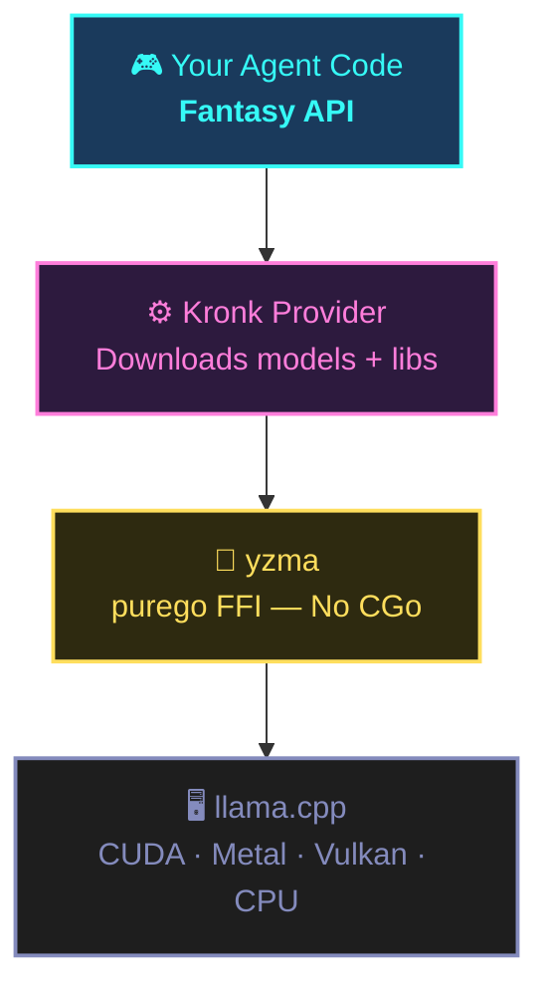
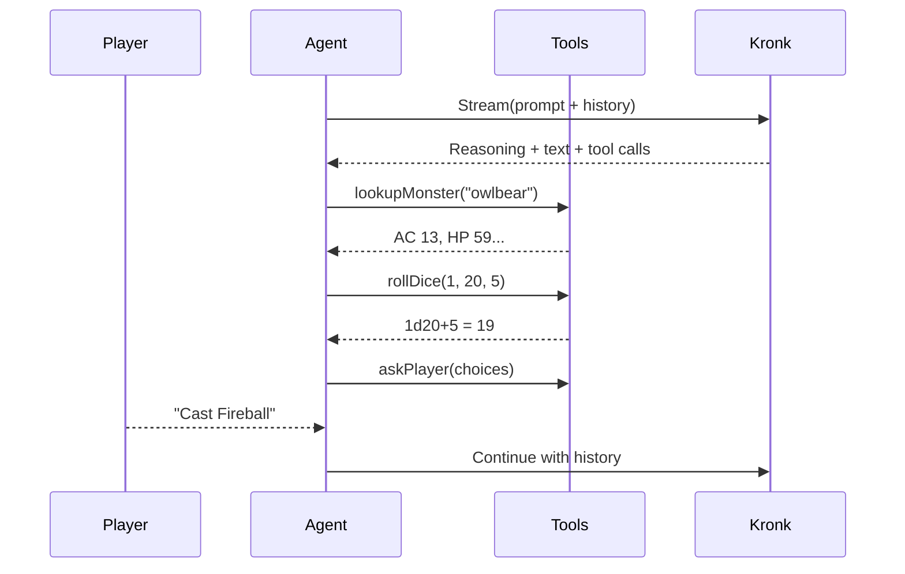

# Build a Local AI Dungeon Master in Go

No CGo. No Python. No Cloud.

<!--
Building a fully local AI agent in Go — with tool calling, streaming, and chain-of-thought reasoning — has never been this clean. No Python. No CGo. No cloud API. Not even an API key.
-->

---
layout: section
---

# The Problem

Not many good ways to do local inference in Go

<!--
Go and local AI used to be a disaster. The whole inference ecosystem was Python-only. If you wanted llama.cpp from Go, you needed CGo bindings — and that was a painful experience.

But before we get into that — if you're new here, on What The Func we talk about AI, coding, and building real things with Go. If that's your kind of content, subscribe to the channel, hit the bell for notifications. Alright, let's get into it.
-->

---

<v-clicks>

- Go ↔ C boundary = **painful debugging** (`dlv` can't step into C)
- Cross-compilation **requires a C toolchain** per target
- Bindings struggle to **keep up with upstream**
- Most Go devs just reached for **cloud APIs** instead

</v-clicks>

<!--
The debugger can't cross the Go-C boundary cleanly. Cross-compilation now requires a C toolchain for every target platform. And if you're binding to something like llama.cpp that moves fast, keeping up with upstream is a constant battle. So most Go developers just reached for a cloud API and moved on.
-->

---

<v-clicks>

- **yzma** by Hybridgroup — `purego` FFI to llama.cpp
- No C compiler. No CGo. Just `go build`
- One project unlocked the **entire stack**

</v-clicks>

<!--
Then yzma by Hybridgroup figured out how to bind to llama.cpp using purego. Pure Go FFI. No C compiler. No CGo headaches. Just go build and it works. That one breakthrough unlocked an entire stack.
-->

---
layout: section
---

# The Stack

Fantasy + Kronk + yzma

<!--
Three projects. Three layers. Each one does exactly one thing. Let me show you how they fit together.
-->

---

<v-clicks>

<NeonBox color="cyan">

**Fantasy** (Charmbracelet) — Agent API
System prompts · Tool definitions · Generate / Stream

</NeonBox>

<NeonBox color="pink">

**Kronk** (Ardan Labs) — Local Provider
Downloads models (GGUF) · Downloads llama.cpp libs · Manages lifecycle

</NeonBox>

<NeonBox color="yellow">

**yzma** (Hybridgroup) — Pure Go FFI
Direct llama.cpp binding · Hardware-accelerated · No CGo

</NeonBox>

</v-clicks>

<!--
Fantasy by Charmbracelet gives you a unified agent API — define tools, set a system prompt, call Generate or Stream. Kronk handles downloading the model and running inference. And yzma is the foundation — pure Go FFI to llama.cpp. First run downloads everything automatically. No installation step. No Makefile. Just go run.
-->

---



<v-click>

First `go run` → **everything downloads automatically**. No installation step.

</v-click>

<!--
Each layer does exactly one thing. Fantasy handles the agent logic. Kronk manages models. yzma does the FFI. And llama.cpp runs hardware-accelerated inference. First time you run the program, everything downloads automatically.
-->

---

## What We're Building

<v-clicks>

- A **local AI Dungeon Master** running D&D 5e encounters
- **Model:** Qwen3-8B @ Q5_K_M (~6GB, downloads automatically)
- Four tools: **ask_player**, **lookup_monster**, **lookup_spell**, **roll_dice**
- Real monster stats from **dnd5eapi.co** — not hallucinated
- Streaming **chain-of-thought reasoning** you can watch in real time

</v-clicks>

<!--
If you've never played D&D — Dungeons & Dragons — it's a tabletop roleplaying game where one person, the Dungeon Master, narrates the story and runs the world while the players make choices. Fifth edition — 5e — is the current ruleset.

We're building a local AI dungeon master. Qwen3-8B quantized, about 6GB, downloads on first run. It has four tools — ask the player for input, look up real monster stats from the D&D 5e API, look up spells, and roll dice with cryptographic randomness. Real data, not hallucinated stats.
-->

---
layout: section
---

# Building the Dungeon Master

<!--
Let's get into the code. Here's the full main.go — I'll walk through every piece.
-->

---

## Constants + Entry Point

```go {lines:true}
const modelURL = "Qwen/Qwen3-8B-GGUF/Qwen3-8B-Q5_K_M.gguf"

const systemPrompt = `You are a D&D 5e Dungeon Master. The player is a level 5 wizard
(32 HP, AC 12) with Fireball, Shield, Misty Step, and Magic Missile prepared. They
stand at a dungeon entrance.

Keep responses to 2-3 sentences max. Never ramble. After describing the scene, stop
and use ask_player immediately.`

func main() {
  if err := run(); err != nil {
    fmt.Fprintf(os.Stderr, "Error: %v\n", err)
    os.Exit(1)
  }
}
```

<v-click>

System prompt is short and behavioral. The real guidance lives in the **tool descriptions**.

</v-click>

<!--
The model URL points to a Qwen3-8B quantized GGUF on Hugging Face — Kronk downloads it automatically on first run.

The system prompt sets up a level 5 wizard — so a mid-power spellcaster — with 32 hit points, which is basically health, and an armor class of 12, which is how hard you are to hit. Fireball, Shield, Misty Step, and Magic Missile are spells the character has ready to cast. You don't need to know D&D to follow along — just think of it as the character sheet the AI is working with.

The prompt is deliberately minimal. The real guidance lives in the tool descriptions — we'll see that in a moment.
-->

---

## Imports

```go {lines:true}
package main

import (
  "bufio"
  "context"
  "crypto/rand"
  "encoding/json"
  "fmt"
  "io"
  "math/big"
  "net/http"
  "os"
  "os/signal"
  "strconv"
  "strings"
  "time"

  "charm.land/fantasy"
  "charm.land/fantasy/providers/kronk"
  "github.com/ardanlabs/kronk/sdk/kronk/model"
  "github.com/joho/godotenv"
)
```

<!--
Standard library imports plus three external packages: Fantasy, Kronk, and godotenv. That's your entire dependency surface.
-->

---

## Stdin Channel

```go {lines:true}
var stdinLines = make(chan string)

func init() {
  go func() {
    s := bufio.NewScanner(os.Stdin)
    for s.Scan() {
      stdinLines <- s.Text()
    }
    close(stdinLines)
  }()
}
```

<v-click>

`bufio.Scanner.Scan()` **blocks and ignores context cancellation**.

Background goroutine + channel = `select` on both input AND `ctx.Done()`.

**Ctrl+C works** even when waiting for player input.

</v-click>

<!--
This channel pattern is subtle but important. bufio.Scanner blocks and ignores context cancellation. By reading in a background goroutine, our tools can select on both input and ctx.Done(). Ctrl+C works even when waiting for player input.
-->

---

## Provider Setup

````md magic-move {lines: true}
```go
func run() error {
  sigCtx, stop := signal.NotifyContext(
    context.Background(), os.Interrupt,
  )
  defer stop()
  godotenv.Load()

  provider, err := kronk.New(
    kronk.WithName("kronk"),
    kronk.WithLogger(kronk.FmtLogger),
  )
  if err != nil {
    return fmt.Errorf("provider: %w", err)
  }
  // ...
}
```
```go
func run() error {
  sigCtx, stop := signal.NotifyContext(
    context.Background(), os.Interrupt,
  )
  defer stop()
  godotenv.Load()

  provider, err := kronk.New(
    kronk.WithName("kronk"),
    kronk.WithLogger(kronk.FmtLogger),
    kronk.WithModelConfig(model.Config{
      CacheTypeK: model.GGMLTypeQ8_0,
      CacheTypeV: model.GGMLTypeQ8_0,
      NBatch:     512,
    }),
  )
  if err != nil {
    return fmt.Errorf("provider: %w", err)
  }
  // ...
}
```
````

<v-click>

q8_0 KV cache cuts VRAM **~50%** with negligible quality loss.

</v-click>

<!--
Inside run we set up a signal context for Ctrl+C, then create the Kronk provider. The q8_0 KV cache quantization cuts VRAM roughly in half compared to f16, with negligible quality loss.
-->

---

## Agent Setup

```go {lines:true}
func run() error {
  // ... signal context + provider setup
  defer func() {
    if c, ok := provider.(interface{ Close(context.Context) error }); ok {
      c.Close(context.Background())
    }
  }()

  llm, err := provider.LanguageModel(sigCtx, modelURL)
  if err != nil {
    return fmt.Errorf("model: %w", err)
  }

  agent := fantasy.NewAgent(llm,
    fantasy.WithSystemPrompt(systemPrompt),
    fantasy.WithTools(
      playerTool(), monsterTool(),
      spellTool(), diceTool(),
    ),
    fantasy.WithMaxOutputTokens(2048),
    fantasy.WithTemperature(0.8),
    fantasy.WithPresencePenalty(1.5),
  )

  return gameLoop(sigCtx, agent)
}
```

<!--
We defer-close the provider so the native libraries get cleaned up. Then load the model — first run downloads the GGUF automatically. The 1.5 presence penalty is a Qwen3-specific recommendation for quantized models — reduces repetitive output.
-->

---

<div class="mermaid-scaled">



</div>

<style>
.mermaid-scaled {
  transform: scale(0.88);
  transform-origin: top center;
}
</style>

<!--
Here's one game turn. The agent streams from Kronk, gets back reasoning, text, and tool calls. It looks up an owlbear — that's a classic D&D monster, literally a bear with an owl head — and gets back real stats like armor class 13, 59 hit points. Then it rolls a d20 — a twenty-sided die — plus 5, which is standard D&D dice notation. Asks the player what they want to do, and feeds everything back into the next turn.
-->

---

## Game Loop

```go {lines:true}
func gameLoop(sigCtx context.Context,
  agent fantasy.Agent,
) error {
  var history []fantasy.Message
  prompt := "Begin."

  fmt.Println("=== D&D 5e ===")
  fmt.Println("Press Ctrl+C to quit")
  fmt.Println()

  for {
    ctx, cancel := context.WithTimeout(sigCtx, 30*time.Minute)
    result, err := agent.Stream(ctx, fantasy.AgentStreamCall{
      Prompt:           prompt,
      Messages:         history,
      OnReasoningStart: onReasoningStart,
      OnReasoningDelta: onReasoningDelta,
      OnReasoningEnd:   onReasoningEnd,
      OnTextDelta:      onTextDelta,
      OnToolCall:       onToolCall,
      OnToolResult:     onToolResult,
    })
    cancel()
    // ...
  }
}
```

<!--
Each iteration is one DM turn. Fantasy doesn't maintain conversation history between Stream calls — you accumulate messages and pass them back in. The 30-minute per-turn timeout is intentional — the player might be thinking.
-->

---

## Game Loop (cont.)

```go {lines:true}
func gameLoop(...) error {
  // ...
  for {
    // ... result, err := agent.Stream(...)

    if err != nil {
      if sigCtx.Err() != nil {
        fmt.Println("\n\n--- Thanks for playing! ---")
        return nil
      }
      return fmt.Errorf("stream: %w", err)
    }

    for _, step := range result.Steps {
      history = append(history, step.Messages...)
    }

    fmt.Println()
    prompt = "Continue."
  }
}
```

<!--
If the signal context is cancelled — meaning Ctrl+C — we print a goodbye and exit cleanly. Otherwise we accumulate the messages from each step and continue the game.
-->

---

## Tool Definitions

```go {lines:true}
func playerTool() fantasy.AgentTool {
  return fantasy.NewAgentTool("ask_player",
    "Present the player with choices. You must call this whenever "+
      "it is the player's turn to act. Provide a question and 3-5 "+
      "options. Do not write options in your response text — this "+
      "tool handles the display. The game cannot continue until "+
      "the player chooses.",
    askPlayer,
  )
}

func monsterTool() fantasy.AgentTool {
  return fantasy.NewAgentTool("lookup_monster",
    "Look up a D&D 5e monster by name to get its real stats. "+
      "Always call this before using any monster in the game.",
    lookupMonster,
  )
}
```

<!--
The descriptions do the heavy lifting. "You must call this whenever it is the player's turn." "Always call this before using any monster." These behavioral instructions belong in the tool description, not the system prompt.
-->

---

## Tool Definitions (cont.)

```go {lines:true}
func spellTool() fantasy.AgentTool {
  return fantasy.NewAgentTool("lookup_spell",
    "Look up a D&D 5e spell by name to get its real details. "+
      "Always call this before resolving a spell.",
    lookupSpell,
  )
}

func diceTool() fantasy.AgentTool {
  return fantasy.NewAgentTool("roll_dice",
    "Roll dice. Specify the number of dice, sides per die, "+
      "and an optional modifier. Always call this — never "+
      "generate random numbers yourself.",
    rollDice,
  )
}
```

<!--
Same pattern for spells and dice. Notice the dice tool says "never generate random numbers yourself" — this prevents the model from hallucinating roll results.
-->

---

## ask_player

```go {lines:true}
type askPlayerInput struct {
  Question string   `json:"question" description:"The question to ask the player"`
  Options  []string `json:"options" description:"List of 3-5 options"`
}

func askPlayer(ctx context.Context,
  input askPlayerInput, _ fantasy.ToolCall,
) (fantasy.ToolResponse, error) {
  fmt.Printf("\n\n--- YOUR TURN ---\n%s\n\n", input.Question)
  for i, opt := range input.Options {
    fmt.Printf("  %d. %s\n", i+1, opt)
  }
  // ...
}
```

<!--
The struct IS the schema — Fantasy generates JSON schema from your field types and description tags. No separate schema definition needed.
-->

---

## ask_player (cont.)

```go {lines:true}
func askPlayer(...) (fantasy.ToolResponse, error) {
  // ... print question and options

  for {
    fmt.Printf("\nChoose [1-%d]: ", len(input.Options))
    select {
    case <-ctx.Done():
      return fantasy.ToolResponse{}, ctx.Err()
    case line, ok := <-stdinLines:
      if !ok {
        return fantasy.NewTextResponse(
          "The player has left the game."), nil
      }
      choice, err := strconv.Atoi(strings.TrimSpace(line))
      if err != nil || choice < 1 || choice > len(input.Options) {
        fmt.Printf("Pick a number between 1 and %d.\n", len(input.Options))
        continue
      }
      chosen := input.Options[choice-1]
      fmt.Printf("-> %s\n\n", chosen)
      return fantasy.NewTextResponse(
        fmt.Sprintf("The player chose: %s", chosen)), nil
    }
  }
}
```

<!--
The select on ctx.Done() is key. Ctrl+C cancels immediately even when waiting for input. We also handle the channel closing gracefully in case stdin hits EOF.
-->

---

## roll_dice

```go {lines:true}
type diceQuery struct {
  Count    int `json:"count" description:"Number of dice to roll (e.g. 2 for 2d6)"`
  Sides    int `json:"sides" description:"Sides per die (e.g. 20 for d20)"`
  Modifier int `json:"modifier" description:"Added to total. Default 0."`
}

func rollDice(_ context.Context,
  input diceQuery, _ fantasy.ToolCall,
) (fantasy.ToolResponse, error) {
  count := max(input.Count, 1)
  sides := max(input.Sides, 1)
  rolls := make([]int, count)
  total := 0
  for i := range count {
    n, _ := rand.Int(rand.Reader, big.NewInt(int64(sides)))
    rolls[i] = int(n.Int64()) + 1
    total += rolls[i]
  }
  total += input.Modifier
  notation := fmt.Sprintf("%dd%d", count, sides)
  if input.Modifier != 0 {
    notation += fmt.Sprintf("%+d", input.Modifier)
  }
  return fantasy.NewTextResponse(
    fmt.Sprintf("Rolling %s: %v = %d", notation, rolls, total)), nil
}
```

<!--
Quick dice notation primer if you're not a tabletop person: "2d6+5" means roll two six-sided dice and add 5. "1d20" is one twenty-sided die. It's just count, sides, modifier.

We learned this the hard way — originally tried passing that notation as a string, like "2d6+5", but the model kept sending malformed input. Typed parameters — count, sides, modifier as separate integers — eliminated the problem entirely. The struct IS the schema.
-->

---

## lookup_monster

```go {lines:true}
type monsterQuery struct {
  Name string `json:"name" description:"Monster name, e.g. owlbear"`
}

func lookupMonster(_ context.Context,
  input monsterQuery, _ fantasy.ToolCall,
) (fantasy.ToolResponse, error) {
  slug := strings.ToLower(strings.ReplaceAll(input.Name, " ", "-"))
  resp, err := http.Get(
    "https://www.dnd5eapi.co/api/monsters/" + slug)
  if err != nil {
    return fantasy.NewTextResponse("Failed to reach D&D API"), nil
  }
  defer resp.Body.Close()

  if resp.StatusCode != 200 {
    return fantasy.NewTextResponse(
      fmt.Sprintf("Monster '%s' not found", input.Name)), nil
  }
  // ...
}
```

<!--
Slug the name, hit the D&D 5e REST API. Real data from the SRD — that's the System Reference Document, basically the free open-source version of the D&D rulebook. Not hallucinated stats. When the Dungeon Master summons an owlbear, it gets the actual owlbear from the rulebook.
-->

---

## lookup_monster (cont.)

```go {lines:true}
func lookupMonster(...) (fantasy.ToolResponse, error) {
  // ... API call + error handling

  body, _ := io.ReadAll(resp.Body)
  var m map[string]any
  json.Unmarshal(body, &m)

  summary := fmt.Sprintf(
    "%s (%s %s, CR %v) | AC %v | HP %v (%v)\n"+
      "STR %v DEX %v CON %v INT %v WIS %v CHA %v | Speed: %v",
    m["name"], m["size"], m["type"], m["challenge_rating"],
    formatAC(m["armor_class"]), m["hit_points"], m["hit_dice"],
    m["strength"], m["dexterity"], m["constitution"],
    m["intelligence"], m["wisdom"], m["charisma"],
    formatSpeed(m["speed"]),
  )
  // ... append actions and special_abilities to summary

  return fantasy.NewTextResponse(summary), nil
}
```

<!--
You can see the stat block format here — CR is Challenge Rating, basically how tough the monster is. STR, DEX, CON, INT, WIS, CHA are the six ability scores every creature has in D&D — Strength, Dexterity, Constitution, Intelligence, Wisdom, Charisma. The full version also loops through the monster's actions and special abilities and appends them to the summary. Same pattern applies to lookup_spell.
-->

---

## lookup_spell

```go {lines:true}
type spellQuery struct {
  Name string `json:"name" description:"Spell name, e.g. fireball"`
}

func lookupSpell(_ context.Context,
  input spellQuery, _ fantasy.ToolCall,
) (fantasy.ToolResponse, error) {
  slug := strings.ToLower(strings.ReplaceAll(input.Name, " ", "-"))
  resp, err := http.Get(
    "https://www.dnd5eapi.co/api/spells/" + slug)
  // ... same error handling as lookupMonster

  body, _ := io.ReadAll(resp.Body)
  var s map[string]any
  json.Unmarshal(body, &s)
  // ... extract desc from s["desc"] array

  summary := fmt.Sprintf(
    "%s (Level %v %s) | %s | Range: %s | Duration: %s\n"+
      "Components: %v\n%s",
    s["name"], s["level"], formatSchool(s["school"]),
    s["casting_time"], s["range"], s["duration"],
    s["components"], desc,
  )
  // ... append damage by slot level
  return fantasy.NewTextResponse(summary), nil
}
```

<!--
Same pattern as monster lookup. You'll notice formatSchool in there — in D&D, every spell belongs to a "school of magic," which is just a category. Evocation is damage spells like Fireball, Abjuration is protection spells like Shield, and so on. So the output reads something like "Fireball (Level 3 Evocation)." The full version also extracts the spell description and appends damage-by-slot-level tables.
-->

---

## Streaming Callbacks

```go {lines:true}
func onReasoningStart(_ string, _ fantasy.ReasoningContent) error {
  fmt.Println("\n[THINKING...]")
  return nil
}
func onReasoningDelta(_, text string) error {
  fmt.Print(text)
  return nil
}
func onReasoningEnd(_ string, _ fantasy.ReasoningContent) error {
  fmt.Println("\n[END THINKING]\n")
  return nil
}
func onTextDelta(_, text string) error {
  fmt.Print(text)
  return nil
}
```

<!--
Qwen3 supports chain-of-thought reasoning, and Fantasy surfaces it through these callbacks. You can watch the model think through D&D rules in real time.
-->

---

## Streaming Callbacks (cont.)

```go {lines:true}
func onToolCall(tc fantasy.ToolCallContent) error {
  if tc.ToolName != "ask_player" {
    fmt.Printf("\n[%s] %s\n", tc.ToolName, tc.Input)
  }
  return nil
}

func onToolResult(res fantasy.ToolResultContent) error {
  if res.ToolName != "ask_player" {
    fmt.Println("-> done")
  }
  return nil
}
```

<v-click>

We skip logging `ask_player` calls — the tool itself handles the display.

</v-click>

<!--
We filter out ask_player from the tool call and result logs because that tool handles its own display. For everything else — monster lookups, dice rolls, spell lookups — you see the call and the result in the terminal.
-->

---

## Helpers

```go {lines:true}
func formatAC(ac any) string {
  if arr, ok := ac.([]any); ok && len(arr) > 0 {
    if m, ok := arr[0].(map[string]any); ok {
      return fmt.Sprintf("%v", m["value"])
    }
  }
  return "?"
}

func formatSpeed(speed any) string {
  m, ok := speed.(map[string]any)
  if !ok {
    return "?"
  }
  parts := make([]string, 0, len(m))
  for k, v := range m {
    parts = append(parts, fmt.Sprintf("%s %v", k, v))
  }
  return strings.Join(parts, ", ")
}
```

<!--
These helpers deal with the D&D 5e API's nested JSON structure. Armor class comes as an array of objects, speed is a map of movement types. Nothing fancy — just type assertions to pull out the values we need.
-->

---

## Helpers (cont.)

```go {lines:true}
func formatSchool(school any) string {
  if m, ok := school.(map[string]any); ok {
    return fmt.Sprintf("%v", m["name"])
  }
  return "?"
}
```

<!--
School is a nested object with a name field — same pattern as the others.
-->

---
layout: center
---

# Demo Time

```bash
go run .
```

<!--
Let's run it. First run downloads everything, then we play a few turns. You'll see real monster stats pulled from the API — not made up. Real spell damage tables. Real dice rolls with actual randomness. All running locally on this machine. No API keys. No cloud.
-->

---
layout: center
---

# Final Thoughts

<div class="mt-8">

<v-clicks>

- `purego` FFI made **CGo-free local inference** possible
- Fantasy + Kronk + yzma = **complete local AI stack** in Go
- Provider-agnostic — swap Kronk for **Anthropic/OpenAI** in one line
- Ship as a **single binary** — `go build` and done

</v-clicks>

</div>

<div v-click class="mt-8">
  <GlowText color="cyan">Full source code in the description.</GlowText>
</div>

<!--
purego FFI was the breakthrough that made all of this possible. The Fantasy, Kronk, and yzma stack gives you a complete local AI toolkit in Go. Fantasy is provider-agnostic so you can swap backends in one line. And at the end of the day, it's Go — go build gives you a single native binary. No runtime. No virtual environment.

Subscribe for more Go in the real world. Drop a comment and tell me what you'd build with this stack.

See you in the next one.
-->
