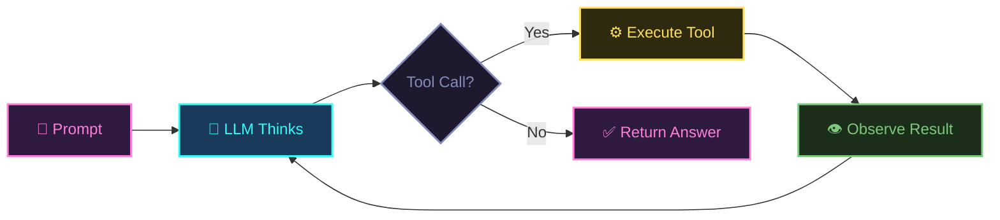
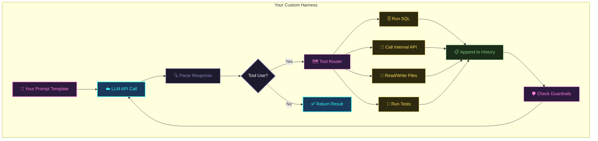
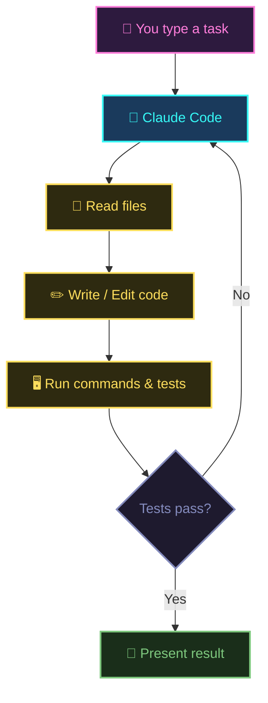
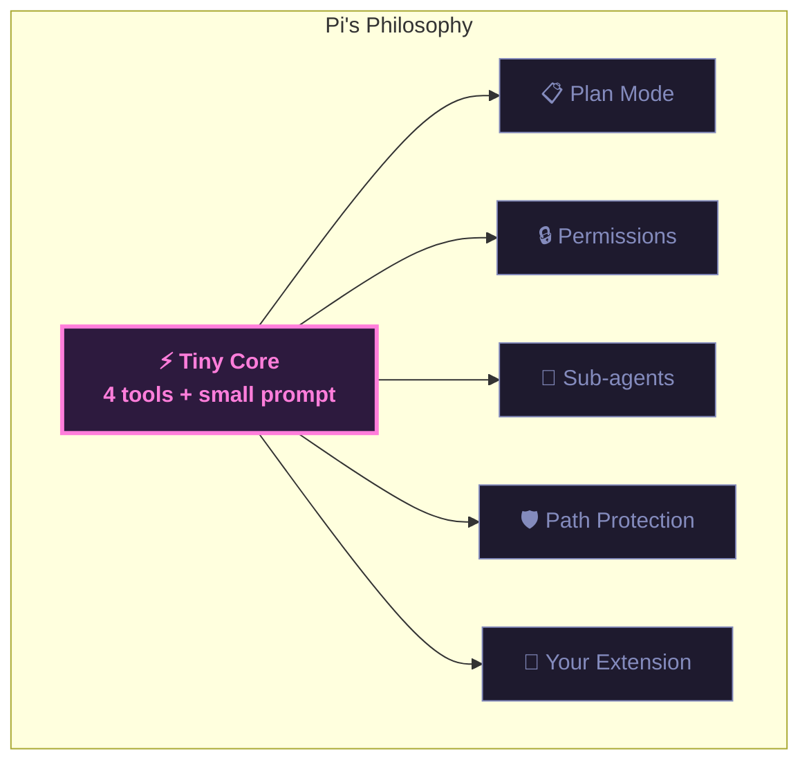
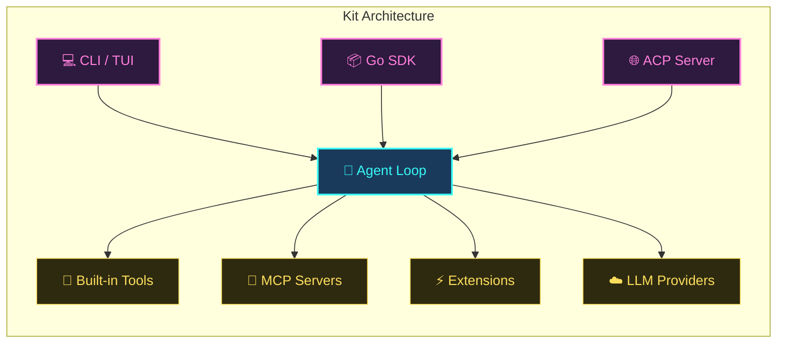
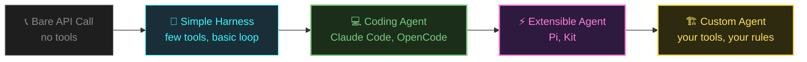

# Harness Engineering

A gentle guide to agent loops, coding agents, and building your own.

<!--
Welcome — today we're going to demystify something that sounds intimidating but is actually really simple: agent loops, and the harnesses that wrap around them.

Full disclosure: I built one of the tools we're going to look at today — Kit, an open-source coding agent written in Go. So this isn't just a survey of the landscape. This is me showing you how I think about this stuff, and why I made the choices I made when building it.

We'll start from the ground up — what the loop is, what a harness actually means, how to build one — and then look at real examples, including the project that inspired me to build Kit in the first place.

If you're new here — on What The Func we talk about AI, coding, and building real things with Go. Subscribe, hit the bell, and let's get into it.
-->

---
layout: section
---

# The Agent Loop

Just a while loop

<!--
Let's start with the foundation. An agent loop. Strip away all the marketing and the magic, and it's just a while loop.

The model thinks, picks a tool, sees the result, and repeats. That's it.
-->

---




<GlowText color="cyan">No magic. Just a loop.</GlowText>


<!--
Here's the loop visualised. Prompt comes in. The LLM thinks. If it wants to call a tool, it does. The result goes back in. The model thinks again. When it has nothing left to do, it returns the final answer.

That's the entire thing. Every coding agent you've ever used — Claude Code, Cursor, Copilot Workspace — is this loop with different tools bolted on.
-->

---

## Every Loop Has 4 Parts


<NeonBox color="pink">

**1. System Prompt** — tells the model who it is and what it can do

</NeonBox>

<NeonBox color="cyan">

**2. Message History** — the running conversation so far

</NeonBox>

<NeonBox color="yellow">

**3. Tools** — things the model can call (shell, files, search…)

</NeonBox>

<NeonBox color="pink">

**4. Stop Condition** — model stops calling tools → done

</NeonBox>


<!--
Every agent loop — no matter how fancy — has these same four parts.

The system prompt sets the scene. The message history is the memory. Tools are the hands. And the stop condition is just "the model didn't call any more tools, so we return."

Keep these four in mind. Everything we look at today is just a variation on these four pieces.
-->

---
layout: section
---

# What's a Harness?

The scaffolding around the model

<!--
Before we look at specific agents, let's define the word we're going to keep using: harness.

What actually is it?
-->

---

## A Harness Is...


- **Which model** to call and how
- **What tools** are available
- **How results** get fed back
- **When to stop** looping
- **Any guardrails** — permissions, cost limits, iteration caps


<div class="mt-6 grid grid-cols-3 gap-4 text-center text-sm">
  <NeonBox color="cyan">Claude Code<br/><span class="text-gray-400">a harness</span></NeonBox>
  <NeonBox color="pink">OpenCode<br/><span class="text-gray-400">a harness</span></NeonBox>
  <NeonBox color="yellow">ChatGPT Code Interpreter<br/><span class="text-gray-400">a harness</span></NeonBox>
</div>


<!--
A harness is just the scaffolding you wrap around a model to make it do useful work.

It decides which model to call. What tools exist. How results flow back. When to stop. And whether there are any guardrails — max iterations, cost limits, permission checks.

Claude Code, OpenCode, ChatGPT's code interpreter — they're all harnesses. We'll look at some of those in a moment. First let's see what building one actually looks like.
-->

---
layout: section
---

# Anatomy of a Custom Harness

<!--
Let's look at what the inside of a harness actually looks like.
-->

---



<!--
Here's what the inside of a custom harness looks like. Your prompt template goes in. LLM responds. You parse the response. If there's a tool call, a router dispatches it to the right function — your SQL runner, your API client, your file system. Results get appended to history. You check guardrails. Then loop back to the LLM.

When there's no tool call, you return the result.

The guardrails step is the one people skip and regret.
-->

---

## The Minimal Version

```python
messages = [system_prompt, user_task]

while True:
    response = call_llm(messages)

    if not response.tool_calls:
        break

    for tool_call in response.tool_calls:
        result = execute_tool(tool_call)
        messages.append(tool_call)
        messages.append(result)

return response
```


<GlowText color="yellow">That's a working agent. Everything else is polish.</GlowText>


<!--
This is the whole thing. In pseudocode, a working agent loop is about 15 lines.

Start with your messages. Call the LLM. If no tool calls — done. Otherwise execute each tool, append the results, and loop.

Everything else — better prompts, smarter tool design, error handling, logging, cost tracking — is polish on top of this.

Don't let the complexity of production agents fool you. The core is this simple.
-->

---

## Tips for Good Harnesses


- **Keep tools simple** — one clear job per tool, with good descriptions
- **Feed back errors** — when a tool fails, return the error; the model will fix its approach
- **Watch your context window** — long loops = long histories; summarize when needed
- **Add guardrails** — max iterations, cost limits, permission checks
- **Log everything** — debugging agent loops without logs is pain


<!--
A few things I've learned the hard way about building harnesses.

Keep tools simple. One job per tool. Write good descriptions — the model can only use what it understands from the description.

Feed errors back to the model. Don't swallow them. Return the error message as the tool result. The model will usually adapt and try a different approach.

Watch your context window. A loop that runs 20 steps accumulates a lot of history. Have a strategy for summarizing or truncating when things get long.

Add guardrails. A loop can loop forever if nothing stops it. Set a max iteration count, a cost limit, or both.

And log everything. When something goes wrong in an agent loop, you need to know exactly what the model did and why.
-->

---

## Why Build a Custom One?

| Need | Example |
|------|---------|
| Domain-specific tools | SQL queries, your internal APIs |
| Custom workflows | Always lint → test → commit |
| Different stop conditions | Stop after 5 steps, or when cost > $2 |
| Controlled context | Only feed relevant files, not the whole repo |
| Integration | CI/CD, Slack, dashboards |


<GlowText color="cyan">Full control over every part of the loop.</GlowText>


<!--
So why would you build your own instead of reaching for an existing agent?

Because sometimes you need something specific. Maybe you need tools that call your internal APIs. Maybe your workflow always has to go lint, then test, then commit — in that exact order. Maybe you want to stop after 5 iterations regardless of whether the model is done. Maybe you want to control exactly which files go into context.

This is actually the exact line of thinking that led me to build Kit. I wanted a coding agent I could embed in my own Go applications, with full control over the tool surface and the loop behaviour. Off-the-shelf wasn't going to cut it.

Now let's look at some of those off-the-shelf options — because they're still great for general use.
-->

---
layout: section
---

# Coding Agents

Agent loops with developer tools

<!--
A coding agent is just a harness where the tools happen to be developer tools: read files, write files, run shell commands, search codebases.

Give a model those tools and a task, and it will iteratively write code, run it, see errors, fix them, and repeat — just like a developer would.

Let's look at two real examples.
-->

---
layout: two-cols
---

## Claude Code


- File read/write
- Shell command execution
- Built-in **permission model**
- Context-aware — understands your project


::right::



<!--
Claude Code is Anthropic's coding agent — it lives in your terminal. Underneath it's the same loop: prompt, think, tool, observe, repeat. The tools are developer-focused: read files, write files, run shell commands. It also has a permission model so it doesn't accidentally nuke your repo.

The diagram on the right shows a typical task flow. It reads relevant files, writes code, runs tests, and if something breaks it loops back and fixes it.

It's a well-built harness around Claude with developer-focused tools. Nothing more, nothing less.
-->

---
layout: two-cols
---

## OpenCode


- Open-source alternative
- **Multi-provider** — not just Claude
- TUI-based interface
- Bring your own API keys


::right::

<div class="flex items-center justify-center h-full">

<NeonBox color="cyan">

**Same idea, open ecosystem**

Agent loop + dev tools + your codebase

Works with Claude, GPT, Gemini, Ollama, and more

</NeonBox>

</div>

<!--
OpenCode is the open-source alternative. Same philosophy — agent loop plus developer tools — but it's community-driven, works with any model provider, and has a terminal UI.

The key insight here: both Claude Code and OpenCode are doing the same thing. The loop is identical. What differs is the tools, the UX, the permission model, and which models they support.
-->

---
layout: section
---

# The Inspiration: Pi

A tiny core that changed how I think about harnesses

<!--
Now I want to talk about a project that really crystallised the right way to think about harness design for me: Pi, by Mario Zechner.

Pi was the direct inspiration for Kit. When I found it, it was one of those "of course, why didn't I think of that" moments.
-->

---

## Pi's Radical Bet


- Just **4 tools**: `read`, `write`, `edit`, `bash`
- System prompt **under 1,000 tokens**
- **No MCP**, no sub-agents, no plan mode baked in
- Models already know how to be coding agents — **get out of the way**


<GlowText color="yellow">Everything else is an extension. You opt in to what you need.</GlowText>


<!--
Pi's thesis was this: models already know how to be coding agents. The harness should get out of the way.

So Pi ships with just four tools and a tiny system prompt. That's it. No plan mode. No permission gates. No sub-agents — none of that built in.

Instead, Pi ships 50-plus example extensions that add those features back. You opt in to what you need. You don't pay for what you don't.

When I saw this I thought: this is exactly right. And I want this in Go.
-->

---




Pi supports **15+ LLM providers** — swap from Claude to GPT to Gemini mid-session.


<!--
This diagram shows Pi's architecture. One tiny core. Extensions branching off it. You compose exactly what you need.

Pi also supports over 15 LLM providers, so you're not locked in. You can switch from Claude to GPT to Gemini mid-session.

That provider-agnostic, extension-first philosophy is what Kit picked up and ran with.
-->

---
layout: section
---

# Kit

So I built one

<!--
Kit — Knowledge Inference Tool — is my attempt to bring Pi's philosophy to Go.

Same minimal core. Same extension-first thinking. Same provider-agnostic design. Just Go — and that language choice was very intentional.
-->

---
layout: two-cols
---

## What Kit Brings


- **8 core tools** — `bash`, `read`, `write`, `edit`, `grep`, `find`, `ls`, `spawn_subagent`
- Extensions in **Go** via Yaegi interpreter
- **10+ providers** — Anthropic, OpenAI, Gemini, Ollama, Bedrock, more
- **Single binary** — no `npm install`, just download and run
- **Go SDK** — embed Kit in your own apps


::right::



<!--
Kit has 8 core tools — slightly more than Pi because Go's tooling benefits from a dedicated grep and find rather than shelling out. The extension system is written in Go using the Yaegi interpreter, so your extensions are first-class Go code.

The architecture diagram on the right shows something I'm particularly proud of: Kit has three entry points. The CLI and TUI for interactive use, a Go SDK so you can embed Kit directly in your own Go applications, and an ACP server mode so other agents — like OpenCode — can drive Kit as a remote coding agent over stdio.

That last one is powerful: Kit can be a sub-agent inside another agent.
-->

---

## What I Took from Pi

| Pi's idea | How Kit does it |
|---|---|
| Small tool surface | 8 core tools, no bloat |
| Extension-first | Go extensions via Yaegi |
| Provider-agnostic | 10+ providers, auto-routing via models.dev |
| Observability | Session tree, JSONL persistence, debug logging |
| Opinionated defaults | Deep customisation via config + extensions |


<GlowText color="pink">Pi proved the philosophy. Go's single binary made it deployable anywhere.</GlowText>


<!--
Here's what I directly took from Pi when building Kit.

Small surface — check. Extension-first — check. Provider-agnostic — check. I also added stronger observability because I wanted to be able to debug sessions after the fact: session trees, JSONL logs, debug output.

The Go choice specifically means one thing for users: single binary. Download it, run it. No Node, no Python, no virtual environment. That matters a lot if you're deploying Kit as part of a service or CI pipeline — which is exactly the use case I was building for.
-->

---
layout: section
---

# The Spectrum

<!--
Let me give you a mental model for where all of this sits.
-->

---




<div class="mt-8 text-center">
<GlowText color="cyan">You don't always need to be on the right.</GlowText>
<br/>
<span class="text-gray-400">Start simple. Add complexity when you actually need it.</span>
</div>


<!--
Here's the spectrum from simplest to most custom.

A bare API call — no tools, just prompt and response. A simple harness with a few tools. A full coding agent like Claude Code. An extensible agent like Pi, or Kit — which is where I'm sitting with my own work. And fully custom agents built on top.

The temptation is to jump to the right end. Don't. Start with a bare API call. Add a tool when you actually need it. Build up from there.

A lot of problems that look like they need a complex agent loop actually just need a better prompt.
-->

---
layout: center
---

# Recap

<div class="mt-8 grid grid-cols-2 gap-4 text-sm">


<NeonBox color="pink">
The <strong>agent loop</strong> is just:<br/>prompt → think → tool → observe → repeat
</NeonBox>

<NeonBox color="cyan">
A <strong>harness</strong> is the scaffolding<br/>that makes the loop work
</NeonBox>

<NeonBox color="yellow">
Build custom when you need<br/><strong>domain tools, custom flow, or guardrails</strong>
</NeonBox>

<NeonBox color="pink">
<strong>Coding agents</strong> are harnesses<br/>with developer tools
</NeonBox>

<NeonBox color="cyan">
<strong>Pi</strong> proved tiny core + extensions<br/>beats kitchen-sink design
</NeonBox>

<NeonBox color="yellow">
<strong>Kit</strong> brings that to Go —<br/>single binary, embeddable, extensible
</NeonBox>


</div>

<!--
Let's recap.

The agent loop is just prompt, think, tool, observe, repeat. No magic.

A harness is everything around the model that makes the loop work — and you can build your own in about 15 lines.

Coding agents are harnesses with developer tools bolted on.

Pi proved that a tiny core plus an extension system beats a kitchen-sink approach.

And Kit brings that philosophy to Go — single binary, embeddable in your own apps, extensible via Go.
-->

---
layout: statement
---

Start small.

A 20-line loop is a real agent.

<!--
I'll leave you with this.

Don't let the complexity of production agents intimidate you. A 20-line loop is a real agent. The craft is in the tools and the prompts — not in the loop itself.

That's what building Kit taught me more than anything. The loop is easy. The hard part is figuring out the right tool surface and getting the prompts right.

Subscribe for more, drop a comment with what you'd build, and if you want to check out Kit — link is in the description. See you in the next one.
-->
