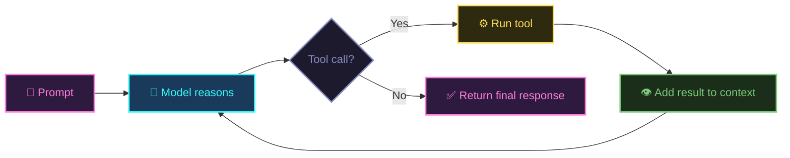
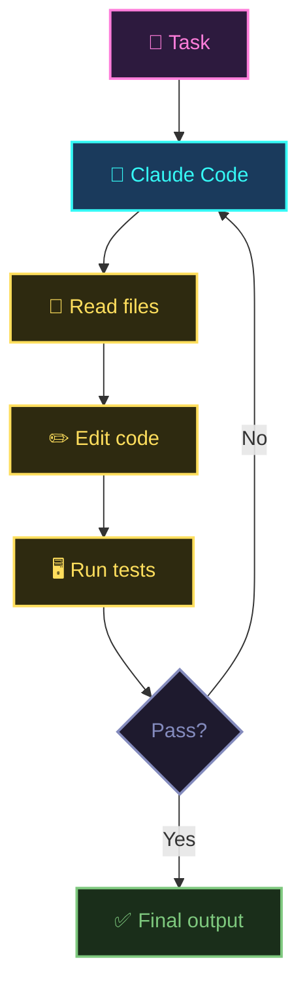
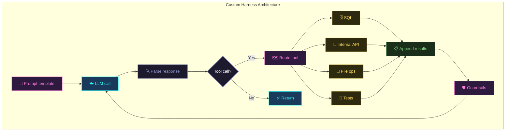
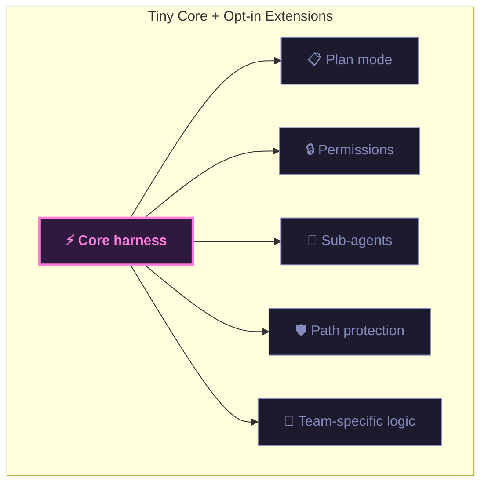
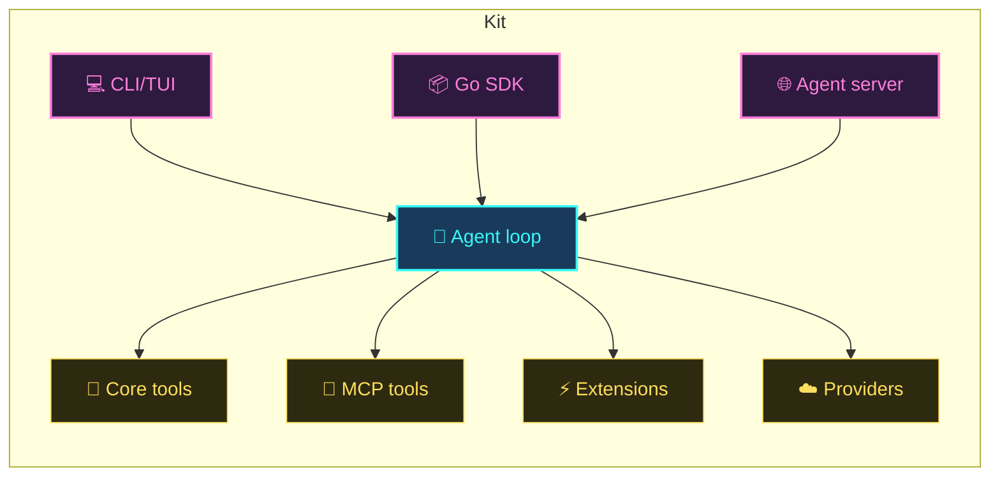

# Harness Engineering

From “what is an agent harness?” to “should I build one?”

<!--
Hey everyone. Today we're going to talk about harness engineering.

We'll start with what an agent loop actually is, then look at what a harness does around that loop, walk through how some real coding agents work, and finish with why and how you might build your own.

The goal is pretty straightforward: by the end of this, you should be able to look at any coding agent and understand the moving parts. And if you need to, you'll know how to build one yourself.

Let's get into it.
-->

---
layout: section
---

# Part 1

## Start with the loop

<!--
Alright, so Part 1. We're going to start at the foundation. Before we talk about products or frameworks or any of that, let's make sure we're all on the same page about what an agent loop is.
-->

---



<GlowText color="cyan">Everything else is implementation detail.</GlowText>

<!--
So here's the core idea. An agent loop is really just a while loop.

You give the model a prompt. It thinks about what to do. If it decides it needs to use a tool, it calls one, gets the result back, and thinks again. It keeps going until it decides it has an answer, and then it stops.

That's it. There's no secret sauce here. Everything else we're going to talk about today is just implementation detail on top of this basic cycle.

If this diagram makes sense to you, the rest of the talk is going to click.
-->

---

## Every loop has 4 moving parts

<NeonBox color="pink">

**1. System prompt** — role + constraints

</NeonBox>

<NeonBox color="cyan">

**2. Message history** — working memory

</NeonBox>

<NeonBox color="yellow">

**3. Tool surface** — actions available to the model

</NeonBox>

<NeonBox color="pink">

**4. Stop condition** — when to return control

</NeonBox>

<!--
Let's break that loop down into its parts. Every agent loop, no matter how fancy, has these same four things.

First, a system prompt. This is where you tell the model who it is and what the rules are. Think of it as the instruction manual.

Second, message history. This is the model's working memory. Every tool call, every result, every response gets appended here. It's how the model remembers what it's already tried.

Third, the tool surface. These are the actions the model can take. Read a file, run a command, search the web, whatever you give it access to.

And fourth, a stop condition. Something has to tell the loop when to quit. Usually that's the model itself deciding it doesn't need to call any more tools. But you can also add hard limits like max iterations or a cost budget.

Keep these four things in your head. Every example from here on maps back to them.
-->

---
layout: section
---

# Part 2

## What a harness is

<!--
Now that we have the loop nailed down, let's zoom out. What's all the stuff that wraps around that loop? That's what we're calling a harness.
-->

---

## Harness = control plane around the loop

- Picks model(s) and call strategy
- Defines tool schemas and routing
- Decides how tool outputs are fed back
- Controls context growth (trim/summarize)
- Enforces guardrails (permissions, budget, limits)
- Defines done criteria

<div class="mt-6 grid grid-cols-3 gap-4 text-center text-sm">
  <NeonBox color="cyan">Claude Code<br/><span class="text-gray-400">harness</span></NeonBox>
  <NeonBox color="pink">OpenCode<br/><span class="text-gray-400">harness</span></NeonBox>
  <NeonBox color="yellow">Code Interpreter<br/><span class="text-gray-400">harness</span></NeonBox>
</div>

<!--
A harness is basically the control plane around your agent loop. It's everything that isn't the model itself.

It picks which model to call, defines the tools, decides how to feed results back, manages context so you don't blow your token window, enforces guardrails, and determines when the loop is done.

Here's the thing that's worth internalizing: the model is the engine, but the harness is the vehicle. And most of the product differentiation between coding agents? It lives in the harness, not the model.

Claude Code, OpenCode, ChatGPT's code interpreter -- they're all harnesses. Different tools, different defaults, different UX. Same basic loop underneath.
-->

---

## Build vs use is a constraints question

| If your primary need is... | Usually start with... |
|---|---|
| Fast productivity | Existing harness |
| Internal APIs/workflows | Custom harness |
| Strict compliance & policy | Custom/extendable harness |
| Model/provider portability | Extendable harness |
| Embedding into your product | SDK-first/custom harness |

<GlowText color="yellow">Use the simplest option that satisfies your constraints.</GlowText>

<!--
So should you build your own or use something that already exists? It depends on your constraints.

If you just need to get work done right now, grab an existing harness. Claude Code, OpenCode, Cursor -- they're all solid. Don't over-engineer it.

But if you need to call internal APIs, enforce a specific execution order, satisfy compliance requirements, or embed the agent into your own product, that's when a custom harness starts making sense.

The key question is: what are your actual constraints? Start with the simplest option that satisfies them. You can always add complexity later, but it's really hard to remove it.
-->

---
layout: section
---

# Part 3

## How coding agents fit

<!--
Alright, let's look at some real coding agents and see how they map to what we just talked about. These are all harnesses. They just made different trade-offs.
-->

---
layout: two-cols
---

## Claude Code

- Strong default coding workflow
- File + shell tools
- Permission model
- Optimized for “do work in this repo now”

::right::



<!--
Claude Code is Anthropic's coding agent. It runs in your terminal, and it's optimized for one job: doing real work in a real codebase, right now.

It gives the model file read and write access, shell command execution, and a permission model so it doesn't do anything destructive without asking. The flow is exactly the loop we talked about: read files, edit code, run tests, check if they pass, and if not, loop back and try again.

It's a well-built harness with strong defaults. If you're working in a single repo and just want the model to help you ship, it's a great choice.
-->

---
layout: two-cols
---

## OpenCode

- Open-source alternative
- Multi-provider support
- Terminal UX
- Easy to adapt and extend

::right::

<div class="flex items-center justify-center h-full">
<NeonBox color="cyan">

**Same loop**

Different defaults,
provider strategy,
and extension model

</NeonBox>
</div>

<!--
OpenCode is an open-source alternative. Same core idea -- agent loop plus dev tools plus your codebase -- but with some different choices.

It works with multiple model providers, not just Claude. It's community-driven. It has a nice TUI. And you bring your own API keys.

The important thing here isn't the feature comparison. It's that this is the same loop with different defaults, a different provider strategy, and a different extension model. The underlying architecture is the same pattern.
-->

---

## When off-the-shelf stops being enough

| Constraint | Why teams go custom |
|---|---|
| Private/internal systems | Need first-class private tools |
| Required execution order | Need deterministic workflow gates |
| Policy/audit requirements | Need custom permission + logging model |
| Cost/latency targets | Need custom stop/context policies |
| Product integration | Need SDK/server embedding |

<GlowText color="cyan">This is the decision boundary for building your own harness.</GlowText>

<!--
So when do these off-the-shelf agents stop being enough?

In my experience, it comes down to a handful of things. You have private internal systems that need first-class tool support, not just "shell out to curl." You need a specific execution order -- like always lint, then test, then deploy -- and you can't trust the model to get the order right every time. You have compliance or audit requirements that need custom permission and logging models. Or you have cost and latency targets that need really specific stop conditions and context management.

When you start hitting these walls, that's the decision boundary. That's when building your own harness stops being over-engineering and starts being the right call.
-->

---
layout: section
---

# Part 4

## Building your own harness

<!--
OK, so you've decided you need something custom. Let's talk about what that actually looks like in practice.
-->

---



<!--
Here's what a custom harness looks like when you draw it out.

Your prompt template goes to the LLM. You parse the response. If there's a tool call, you route it to the right handler -- maybe that's a SQL query against your database, a call to an internal API, file operations, or running tests. The results get appended to history, you check your guardrails, and then you loop back to the LLM.

Notice this is the exact same loop from the first slide. We've just added a tool router and guardrails. That's really all a custom harness is -- the same pattern with your specific tools and your specific safety checks wired in.
-->

---

## Minimal loop (already useful)

```python
messages = [system_prompt, user_task]

while True:
    response = call_llm(messages)

    if not response.tool_calls:
        return response

    for tool_call in response.tool_calls:
        result = execute_tool(tool_call)
        messages.append(tool_call)
        messages.append(result)
```

<GlowText color="yellow">Small loop, real agent.</GlowText>

<!--
And here's the part that surprises people. The minimal version of this is really short.

Set up your messages with a system prompt and the user's task. Start a while loop. Call the LLM. If the response doesn't have any tool calls, you're done -- break out and return the answer. If it does have tool calls, execute each one, append the call and the result to your message history, and loop back.

That's a working agent. Like, actually working. You can run this and it will do useful things.

Everything else -- better prompts, smarter tool design, error handling, logging, cost tracking -- that's all polish. Important polish, sure. But the core? It's this.
-->

---

## Practical rules that prevent pain

- Keep tools narrow (one job, clear schema)
- Return errors to model; don’t hide failures
- Track iterations + token/cost budget per session
- Summarize history before context quality collapses
- Log every model response and tool execution
- Add hard stop criteria from day one

<!--
Now, once you've got the loop running, here are the things that'll save you from pain later.

Keep your tools narrow. One job per tool, clear descriptions. The model can only use what it can understand from the schema.

Feed errors back. When a tool call fails, don't swallow the error. Return it to the model. It'll usually figure out what went wrong and try a different approach. This is one of the most underrated things you can do.

Track your budget. Iterations, tokens, dollars. Set limits from day one, because an agent loop with no stop condition will happily burn through your API credits at 3am.

Summarize your history before it gets too long. Once context quality starts to degrade, the model makes worse decisions, which leads to more loops, which makes things worse. It's a downward spiral.

And log everything. Every model response, every tool call, every result. When something goes sideways in production, logs and guardrails are the difference between debugging and guessing.
-->

---
layout: section
---

# Part 5

## Why I built Kit

<!--
So I want to wrap up by talking about something I've been working on. This is the part where I show my work -- how these ideas turned into a real project.
-->

---

## The inspiration: Pi

- Tiny core: `read`, `write`, `edit`, `bash`
- Minimal prompt + minimal assumptions
- Extension-first architecture
- Broad model-provider support

<GlowText color="yellow">Pi convinced me: composability beats kitchen-sink design.</GlowText>

<!--
Before I get into Kit, I want to give credit where it's due. Pi is a coding agent by Mario Zechner, and it kind of changed how I think about harness design.

Pi's core is radically small. Four tools: read, write, edit, and bash. A system prompt under a thousand tokens. No MCP baked in, no sub-agents, no plan mode in the core.

And the reasoning behind that is actually pretty compelling: modern models already know how to be coding agents. They've been trained on enough code and enough tool-use patterns that they don't need a lot of hand-holding. So the harness should get out of the way and let the model do its thing.

Everything else in Pi is an extension. It ships over fifty example extensions that add back features like plan mode, permission gates, sub-agents, and more. You opt in to what you actually need instead of getting a kitchen sink you can't simplify.

That clicked for me. Composability beats complexity.
-->

---



<!--
This is what that philosophy looks like visually. You've got a tiny core in the center, and everything else plugs in as an extension. Plan mode, permissions, sub-agents, path protection, your own team-specific logic -- they're all optional layers.

The core stays small and stable. The extensions let you customize without forking. It's a really clean separation.
-->

---
layout: two-cols
---

## Kit (open source)

- 8 core tools:
  `bash`, `read`, `write`, `edit`, `grep`, `find`, `ls`, `spawn_subagent`
- Provider-agnostic
- Extension model in Go
- Single binary deployment
- Go SDK + CLI/TUI

::right::



<!--
So Kit is what happens when you take Pi's ideas and bring them to Go.

The core has eight tools: bash, read, write, edit, grep, find, ls, and spawn_subagent. It's provider-agnostic, so you can use Anthropic, OpenAI, Gemini, Ollama, Bedrock, whatever you want. Extensions are written in Go using the Yaegi interpreter, so they're real code, not config files.

And because it's Go, you get a single binary. No npm install, no dependency hell. Just download it and run. There's also a Go SDK so you can embed Kit directly into your own applications, and it ships with an ACP server mode so other agents can drive it remotely.

The architecture here shows the three entry points -- CLI, SDK, and agent server -- all feeding into the same agent loop, which connects to your tools, MCP servers, extensions, and LLM providers.
-->

---

## Why this matters to you

Build your own harness if you need:

- First-class tools for your domain
- Strong control over policy and safety
- Better observability and debuggability
- Embedding in your product/backend
- Freedom to experiment with model/tool strategy

Or start with Kit if you want those capabilities without building from zero.

<GlowText color="cyan">Start simple. Add complexity only when constraints demand it.</GlowText>

<!--
So why does any of this matter to you?

If you need first-class tools for your domain -- not just "shell out to something" but actual typed, well-described tools -- a custom harness gives you that. If you need strong control over policy and safety, or better observability into what the model is doing and why, or you want to embed an agent into your product or backend, or you just want the freedom to experiment with different models and tool strategies -- that's when you want to build your own.

Or, if you want those capabilities without starting from scratch, give Kit a look. That's what it's there for.

The main takeaway: start simple. Add complexity only when your constraints actually demand it.
-->

---
layout: center
---

# Recap

<div class="mt-8 grid grid-cols-2 gap-4 text-sm">

<NeonBox color="pink">
Agent loop = <strong>prompt → tool use → observe → repeat</strong>
</NeonBox>

<NeonBox color="cyan">
Harness = <strong>control plane</strong> around that loop
</NeonBox>

<NeonBox color="yellow">
Coding agents are harnesses with <strong>developer tools</strong>
</NeonBox>

<NeonBox color="pink">
Build custom when <strong>constraints</strong> justify it
</NeonBox>

<NeonBox color="cyan">
Pi inspired a minimal, extension-first philosophy
</NeonBox>

<NeonBox color="yellow">
Kit brings that approach to Go, open source
</NeonBox>

</div>

<!--
Let's bring it all together.

An agent loop is just prompt, tool use, observe, repeat. Nothing more.

A harness is the control plane you build around that loop. It's where all the interesting decisions live.

Coding agents like Claude Code and OpenCode? They're harnesses with developer tools plugged in. Same pattern, different trade-offs.

You should build custom when your constraints justify it -- not before. Don't over-engineer something that an off-the-shelf tool handles fine.

Pi showed that a tiny core with a good extension system beats trying to build everything in. And Kit brings that approach to Go as an open-source project you can use or learn from.
-->

---
layout: statement
---

Understand the loop.

Then choose your harness strategy on purpose.

<!--
Understand the loop first. Then choose your harness strategy on purpose, not by accident.

If you want to experiment quickly, try Kit. If you need total control, build your own. Either way, you now have the mental model to reason about it.

Thanks for listening. Happy to take questions.
-->
