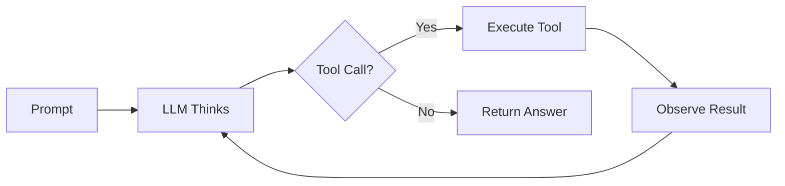
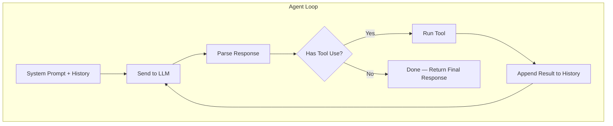
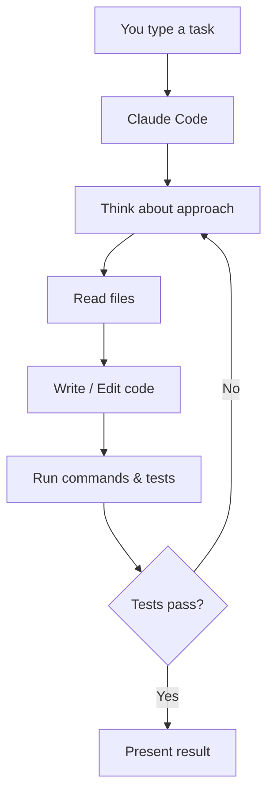
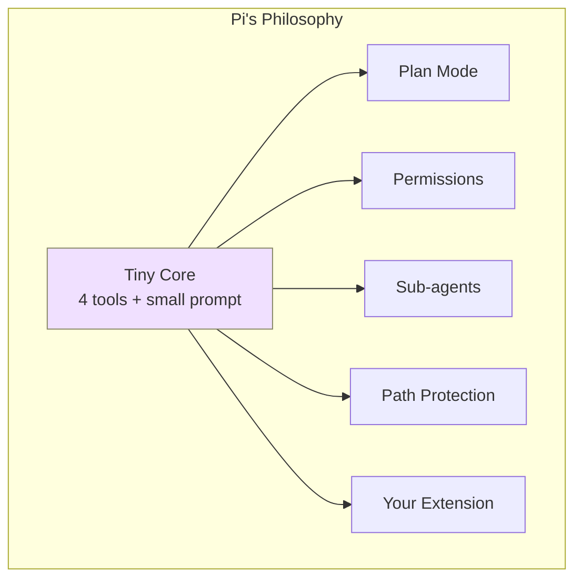
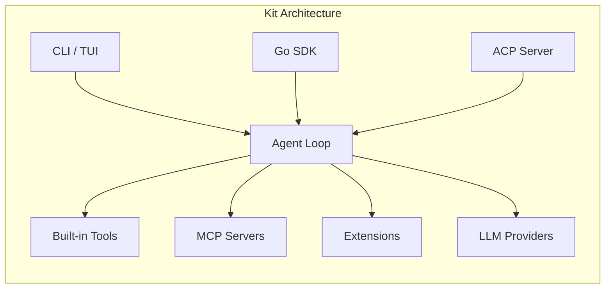
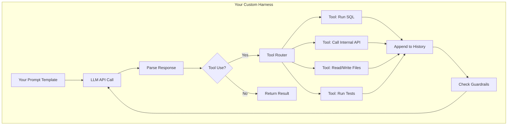
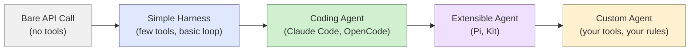

# Harness Engineering

A gentle guide to understanding agent loops, coding agents, and building your own harness.

---

## What's an Agent Loop?

At its core, an agent loop is surprisingly simple. It's just a **while loop** that keeps running until the model decides it's done.

The model thinks, picks a tool, sees the result, and repeats.



That's it. No magic. Just a loop.

---

## The Pieces of the Loop

Every agent loop has the same handful of parts:

1. **A system prompt** — tells the model who it is and what it can do
2. **A message history** — the running conversation so far
3. **Tools** — things the model can call (run shell commands, read files, search, etc.)
4. **A stop condition** — the model says "I'm done" by not calling any more tools



---

## Coding Agents: The Idea

A **coding agent** is just an agent loop where the tools happen to be developer tools:

- Read/write files
- Run shell commands
- Search codebases
- Execute tests

Give a model these tools and a task, and it will iteratively write code, run it, see errors, fix them, and repeat — just like a developer would.

---

## Claude Code

[Claude Code](https://docs.anthropic.com/en/docs/claude-code) is Anthropic's coding agent. It lives in your terminal.

**What it gives you:**
- File read/write
- Shell command execution
- Built-in permission model (so it doesn't `rm -rf` your repo)
- Context-aware — understands your project structure



It's essentially a well-built harness around Claude with developer-focused tools.

---

## OpenCode

[OpenCode](https://github.com/opencode-ai/opencode) is an open-source alternative with a similar philosophy.

**Key differences from Claude Code:**
- Works with multiple model providers (not just Claude)
- Community-driven
- TUI-based interface
- Bring your own API keys

Same idea though: agent loop + dev tools + your codebase.

---

## The Inspiration: Pi

[Pi](https://pi.dev) is a coding agent by Mario Zechner that proved you don't need much to build a great harness.

**Pi's radical bet:** just 4 tools (`read`, `write`, `edit`, `bash`) and a system prompt under 1,000 tokens. That's it. No MCP, no sub-agents, no plan mode baked in. The reasoning? Models already know how to be coding agents — the harness should get out of the way.

Everything else is an **extension**. Pi ships 50+ example extensions that add back features like plan mode, permission gates, sub-agents, and more. You opt in to what you need.



Pi supports 15+ LLM providers, so you can switch from Claude to GPT to Gemini mid-session. It showed that a minimal, opinionated core with a powerful extension system beats a kitchen-sink approach.

---

## Kit: Pi's Ideas, in Go

[Kit](https://github.com/mark3labs/kit) (Knowledge Inference Tool) takes the lessons from Pi and brings them to Go.

**Same philosophy, different language:**
- Minimal built-in tools: `bash`, `read`, `write`, `edit`, `grep`, `find`, `ls`, `spawn_subagent`
- Extension system written in Go (via Yaegi interpreter)
- Multi-provider support: Anthropic, OpenAI, Gemini, Ollama, Bedrock, and more
- No bloat in the core — extend what you need

**What Go brings to the table:**
- Single binary — no `npm install`, just download and run
- A Go SDK so you can embed Kit in your own apps
- Fast startup, strong concurrency
- Natural fit for teams already writing Go services



Kit also ships with an **ACP server** mode, so other agents (like OpenCode) can drive Kit as a remote coding agent over stdio.

---

## Pi → Kit: What Carried Over

| Idea from Pi | How Kit does it |
|---|---|
| Small tool surface | 8 core tools, no MCP overhead by default |
| Extension-first | Go extensions via Yaegi — tools, commands, widgets, shortcuts |
| Provider-agnostic | 10+ providers, model aliases, auto-routing via models.dev |
| Observability | Session tree, JSONL persistence, debug logging |
| Opinionated defaults, optional complexity | Sensible out of the box, deep customization via config + extensions |

---

## So... What's a Harness?

A **harness** is just the scaffolding you wrap around a model to make it do useful work.

It includes:
- Which model to call and how
- What tools are available
- How tool results get fed back
- When to stop looping
- Any guardrails or permissions

Claude Code is a harness. OpenCode is a harness. ChatGPT's code interpreter is a harness.

---

## Why Build a Custom Harness?

Off-the-shelf agents are great, but sometimes you need something specific:

| Need | Example |
|------|---------|
| Domain-specific tools | SQL queries, API calls to your services |
| Custom workflows | Always lint → test → commit in that order |
| Different stop conditions | Stop after 5 iterations, or when cost > $2 |
| Controlled context | Only feed relevant files, not the whole repo |
| Integration | Plug into your CI/CD, Slack, dashboards |

A custom harness lets you control every part of the loop.

---

## Anatomy of a Custom Harness



---

## Building One: The Minimal Version

A custom harness in pseudocode is short:

```
messages = [system_prompt, user_task]

while true:
    response = call_llm(messages)

    if response has no tool calls:
        break

    for each tool_call in response:
        result = execute_tool(tool_call)
        messages.append(tool_call)
        messages.append(result)

return response
```

That's a working agent. Everything else is polish:
- better prompts, smarter tool design, error handling, logging, cost tracking.

---

## Tips for Good Harnesses

**Keep tools simple** — one clear job per tool, good descriptions. The model can only use what it understands.

**Feed back errors** — when a tool fails, return the error to the model. It'll usually fix its approach.

**Watch your context window** — long loops mean long histories. Summarize or truncate when needed.

**Add guardrails** — max iterations, cost limits, permission checks. Loops can loop forever if you let them.

**Log everything** — you'll want to see what the model did and why. Debugging agent loops without logs is pain.

---

## The Spectrum



You don't always need to be on the right. Start simple, add complexity when you actually need it.

---

## Recap

- The **agent loop** is just: prompt → think → tool → observe → repeat
- **Coding agents** like Claude Code and OpenCode are agent loops with dev tools
- A **harness** is everything around the model that makes the loop work
- **Pi** proved that a tiny core + extensions beats a kitchen-sink agent
- **Kit** brings that philosophy to Go — single binary, embeddable, extensible
- Building a **custom harness** gives you full control over tools, flow, and guardrails
- Start small. A 20-line loop is a real agent.

---

*Keep it simple. The loop is the easy part — the craft is in the tools and prompts.*
